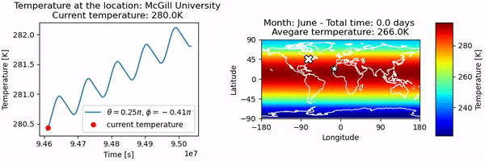

# A Simulation of Thermal Inertia

## About
This repository contains Python functions for running a simulation of the global climate that accounts for **thermal inertia**. The model assumes that the thermal conductivity of the surface of earth is that of water. It can simulate **ice-albedo feedback**. Since the model accounts for the **obliquity** of the earth, it can simulate **seasons**.  

The simulation is created in the form of an **animation** that can be saved as a video. This animation shows how the **temperature distribution** on the earth changes over time. Depending on the temporal resolution the model can distinctly resolve **diurnal cycle** and the **seasonal cycle**. The location of the **substellar point** is also animated. 

Given the **name of a location**, the model can generate a plot of the temperature at that location that updates along with the animation for a closer inspection. 

## How to use it

### The Animation
In the *worldmap.py* file the `temperature_animation()` function will create an animation of the temperature distribution on Earth on a map over a specified period of time. If the name of a location is passed a parameter, a plot of the temperature at that location over time will be generated next to the map. 

### Single Locations Only
In the *worldmap.py* file the `plot_location()` function will generate a plot of the temperature distribution at a location specified by name over a desired period of time. 

### Possibilities
All the parameters in the model can easily be altered to simulate various scenarios such as a tidally locked earth. 

